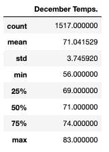
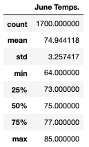

# Surfs Up

## Tools
- SQlite, SQLAlchemy, Flask
- Juypter Notebook, VS Code

## Overview
In this analysis we provide weather analyses to a prospective investor for Surf and Shake, a shop serving surfboards and ice creams to Hawaii locals and tourists. Weather forecast is important because it will determine where, when, and how often the shop will receive business; better weather means better surf and shake sales. We use temperature data from several weather stations. 

## Results
- Average temperature in June (74.99 degrees) is approximately 3 degrees higher than in December (71.04 degrees). 
- Max temp in June (85 degrees) is two degrees higher than in December (83 degrees).
- Minimum temperature in December. (56 degrees) is 10 degrees lower than min temperature in June (64 degrees).

## Summary
While June is just slightly warmer-  the difference in weather temp between winter and summer is negligible- both hovering in the 70s. It would be best to look into other variables and query for precipitation and wind differences throughout the year.
